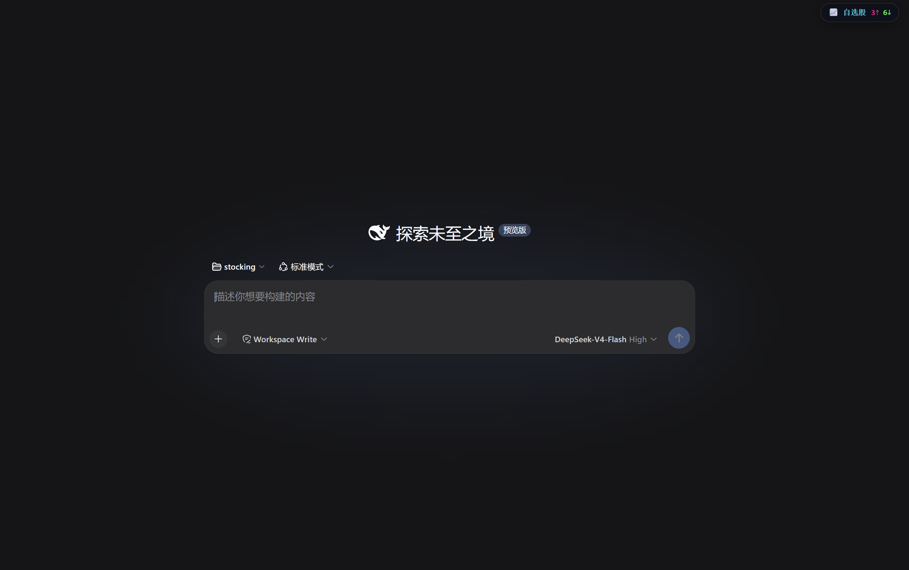
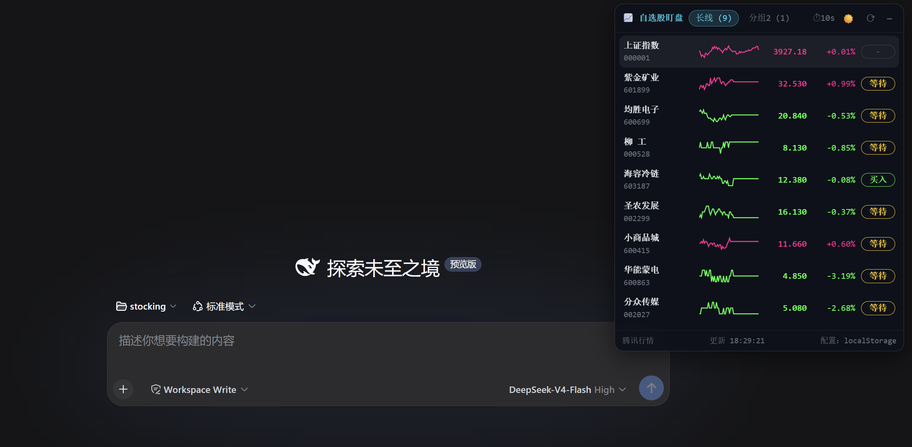
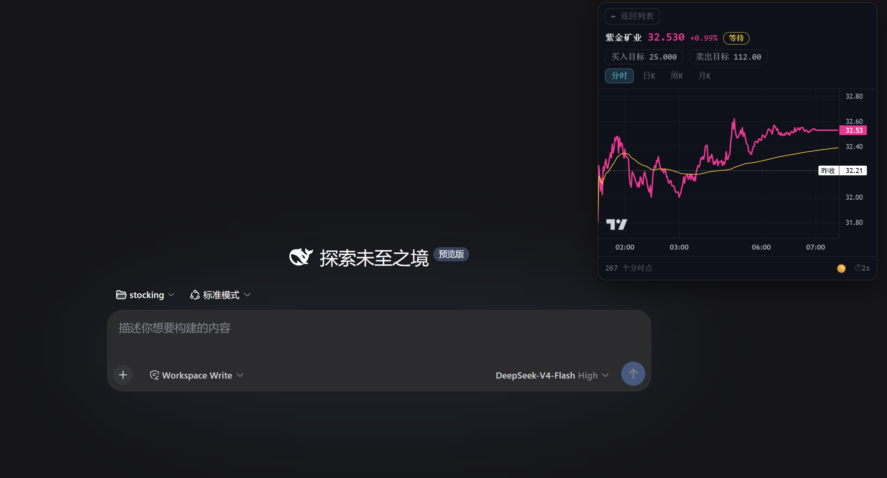
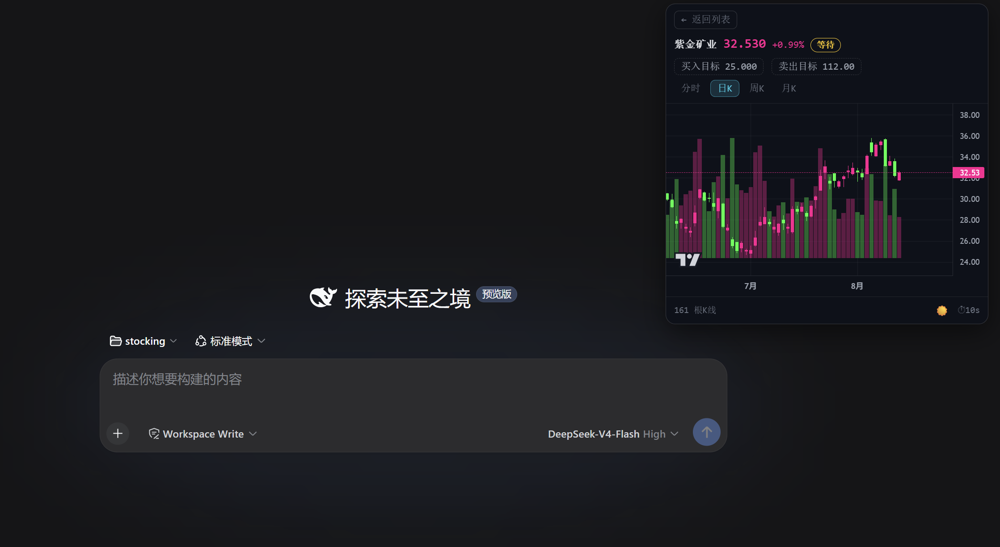
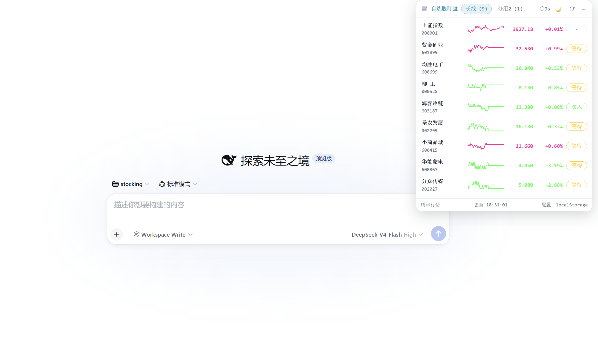

# dsh-stock-watch

A 股自选股实时行情**盯盘插件**：在 [DeepSeek Harness](https://github.com/deepseek-ai/deepseek-harness)（DSH）Web 界面的**右上角**显示一个可折叠弹窗，实时监控自选股行情、切换分组、查看分时与 K 线、设置买卖目标价。

本插件是终端 CLI 项目 [stocking](https://github.com/Awu12277/stocking) 的 Web 伴生扩展，数据源与 CLI 同源（腾讯财经），配色沿用 A 股红涨绿跌惯例。

## 截图

| 折叠药丸（右上角实时涨跌家数） | 暗色列表（分组 + 分时迷你折线 + 目标价触发） |
|---|---|
|  |  |

| 暗色·分时（价格线 / 均价线 / 昨收基准） | 暗色·日 K（TradingView Lightweight Charts） |
|---|---|
|  |  |

| 浅色主题 |
|---|
|  |

## 功能特性

- **右上角可折叠弹窗**：折叠时显示自选股实时涨跌家数药丸；展开为完整列表，点击任意行进入详情
- **多分组自选股**：分组 tab 切换（分组名 + 股票数），配置存浏览器 `localStorage`（首次自动从 `~/.stocking/settings.json` 迁移）
- **实时行情列表**：名称 / 代码、现价、涨跌幅、分时迷你折线、目标价触发标记（买入 / 卖出 / 等待 / -），每 10s 自动刷新（带倒计时）
- **分时视图**：全天分钟价格线（红涨绿跌）+ 黄色均价线（VWAP）+ 昨收虚线基准，X 轴带时间
- **K 线视图**：日 K / 周 K / 月 K 前复权蜡烛图 + 成交量柱，基于 [TradingView Lightweight Charts](https://tradingview.github.io/lightweight-charts/docs)（CDN 懒加载，失败自动降级为自绘 SVG）
- **目标价可编辑**：详情页点击「买入目标 / 卖出目标」进入输入框（数字 + 两位小数、留空清除、回车确认 / Esc 取消），即时重算触发标记并持久化
- **暗色 / 浅色主题**：CSS 变量两套配色，默认暗色，☀️/🌙 一键切换（图表配色联动）

## 快速开始

这是一个 DSH **动态 Cordis 插件**（会话级、进程内运行）。在 DSH Web 会话中通过 `cordis_define` / `cordis_run` 工具加载：

1. 复制 [`plugin/host.js`](plugin/host.js) 内容作为 `code.host`，[`plugin/client.js`](plugin/client.js) 内容作为 `code.client`
2. `cordis_define` 创建插件（host + client），`cordis_run` 激活（首次需在运行卡片中授权）
3. 刷新页面，右上角出现「📈 自选股」药丸

> 注意：动态插件随进程/会话重启而失效，重新 `cordis_run` 即可；如需长期挂载可将其固化为 host 侧组合插件。

## 架构

```
┌─────────────── Web 浏览器 ───────────────┐
│  Client（code.client）                    │
│  · shell.overlay 槽位 → 右上角弹窗         │
│  · React + Lightweight Charts + SVG 降级  │
│  · 配置存 localStorage（stocking.config.v1）│
│          │ host.call (JSON RPC)           │
└──────────┼────────────────────────────────┘
           ▼
┌─────────────── DSH Host（code.host）──────┐
│  · stocking.config / quotes / kline /      │
│    minute 四个包私有 RPC                    │
│  · Node fetch 桥：subprocess 原生 spawn     │
│    node 子进程，用 Node 全局 fetch 并发拉取  │
│  · 腾讯财经接口解析 + 容错清洗 + 诊断信息     │
└───────────────────────────────────────────┘
```

### 为什么用 Node fetch 桥？

- 部署组合默认**不挂载任何 web fetch provider**（防 SSRF 策略），`web.fetch` 必然不可用
- shell 执行器沙箱**封锁出站网络**
- 因此 Host 通过 `subprocess` 服务原生 spawn `node` 子进程直连腾讯接口 —— **与原项目 CLI 的 `fetch(url)` 完全同源**，不受沙箱限制

### 数据源

- 行情快照 + 分时：`https://web.ifzq.gtimg.cn/appstock/app/minute/query?code={code}&r=0.1`
- 日/周/月 K 线：`https://web.ifzq.gtimg.cn/appstock/app/fqkline/get?param={code},{period},,,{count},qfq`

解析逻辑（字段索引、K 线 `[date, open, close, high, low, volume]` 列序、昨收由 `现价/(1+涨跌幅%)` 反推）与 [stocking 的 market.ts](https://github.com/Awu12277/stocking/blob/main/src/market.ts) 保持一致。

## 交互说明

| 状态 | 操作 |
|---|---|
| 药丸 | 点击展开 |
| 列表 | 分组 tab 切换 · 点击行进详情 · ⟳ 手动刷新 · — 折叠 · ☀️/🌙 切主题 |
| 详情 | ← 返回 · 分时 / 日K / 周K / 月K 切换 · 点击买入/卖出目标编辑 |

## 配置与持久化

- 自选股配置（分组、代码、买卖目标价）存浏览器 `localStorage`（key：`stocking.config.v1`）
- 首次打开自动从 `~/.stocking/settings.json` 一次性迁移（失败则用默认分组），之后 localStorage 为唯一数据源
- 重置：`localStorage.removeItem('stocking.config.v1')` 后刷新页面

## License

MIT
